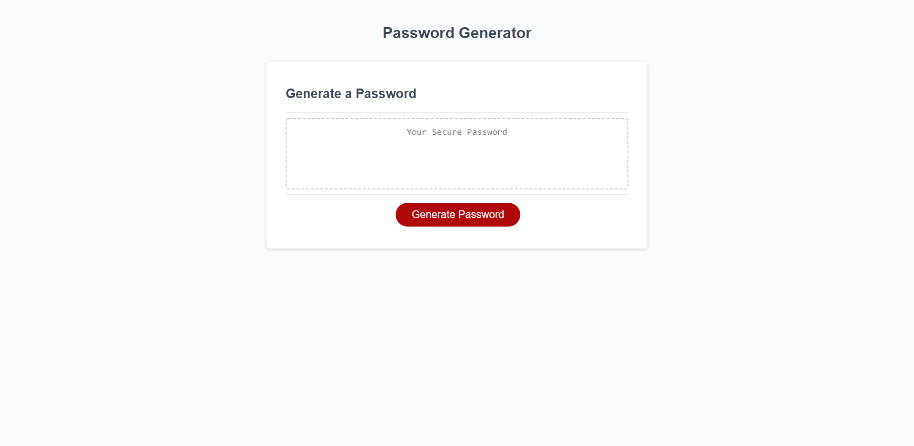

# Password-Generator

## Introduction

Our task for this assignment was to create a browser-based web application that generates a random password based on user-selected criteria. The Password-Generator will run in the browser and my JavaScript code will enable dynamically updated HTML and CSS. The app will be responsive, ensuring that it adapts to multiple screen sizes and will also feature a clean and polished user interface. 

## Instructions

When the user clicks the generate password button they will be presented with a series of prompts for password criteria. The user will select the length of the password, between 8 and 128 characters. They will then choose which character types to be included in the password from lowercase, uppercase, numeric, and/or special characters. Then a unique, randomly generated password matching the user's selected criteria will be displayed on the page.  

## Technologies

* HTML
* CSS
* JavaScript

## Deployed

[GitHub Repo](https://github.com/bosshogg86/Password-generator)

[Password-Generator](https://bosshogg86.github.io/Password-generator/)

